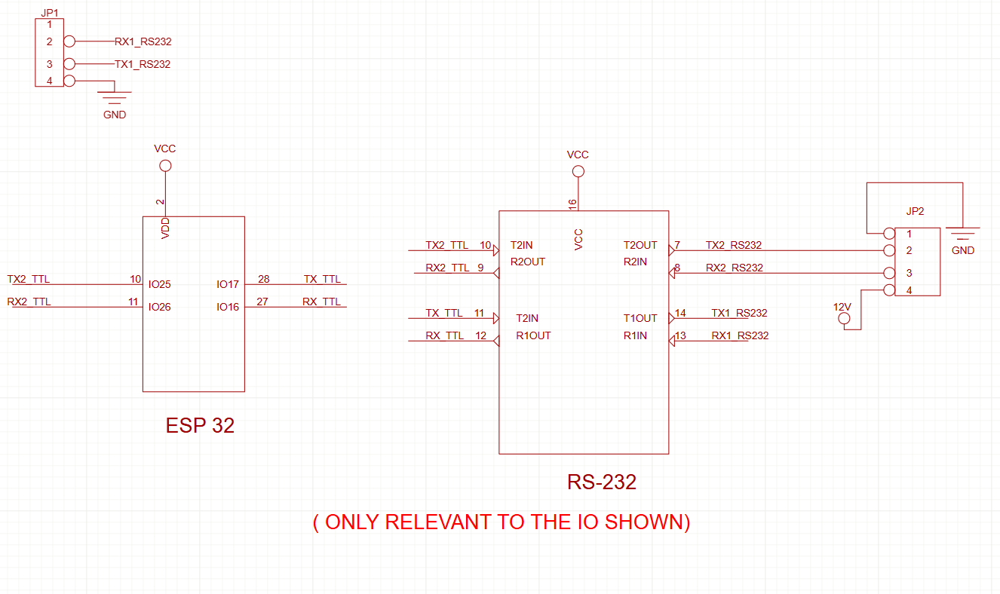

## iSYS4001 Library

An easy-to-use library for the InnoSenT iSYS4001 radar sensor. It provides a high-level C++ API to start/stop acquisition, configure output filters and thresholds, read single/multiple targets, and persist settings to EEPROM.

### Table of Contents
- [Features](#features)
- [Supported platforms](#supported-platforms)
- [Installation](#installation)
- [Wiring (example: ESP32)](#wiring-example-esp32)
- [Quick start](#quick-start)
- [Examples](#examples)
- [API overview](#api-overview)
- [Return codes](#return-codes)
- [Architecture and protocol (high-level)](#architecture-and-protocol-high-level)
- [Data model](#data-model)
- [Enumerations (selected)](#enumerations-selected)
- [Configuration semantics](#configuration-semantics)
- [EEPROM operations](#eeprom-operations)
- [Timing & performance guidance](#timing--performance-guidance)
- [Troubleshooting](#troubleshooting)
- [Versioning & compatibility](#versioning--compatibility)
- [Authors](#authors)

### Features
- **Target acquisition**: Read 16-bit and 32-bit target lists with range, velocity, angle, and signal
- **Configuration**: Set/get min/max for range, velocity, signal; set direction filters; set output filter type
- **EEPROM support**: Save factory, sensor, application, or all settings
- **Device address**: Get/set device address
- **Debugging**: Optional debug output to any `Stream`

### Supported platforms
- Arduino-compatible boards with a hardware UART (e.g., ESP32 uses `Serial2` in the example)

### Installation
1. Download or clone this repository into your Arduino `libraries` folder as `iSYS4001`.
2. Or, use Sketch → Include Library → Add .ZIP Library… and select the ZIP of this repo.
3. Include the header in your sketch:

```cpp
#include <iSYS4001.h>
```

### Wiring (Example: ESP32)
- Connect the iSYS4001 UART interface to your board’s hardware serial pins  
  (this example uses `Serial2` on **GPIO16** for RX and **GPIO17** for TX).  
- Power the sensor according to its datasheet specifications.  



---

### Quick Start
The snippet below demonstrates initialization, starting acquisition, basic configuration,  
and reading target lists:

```cpp
#include <iSYS4001.h>


// Create radar object on a hardware serial port
iSYS4001 radar(Serial2, 115200);

const uint8_t RADAR_ADDRESS = 0x80;
const uint32_t TIMEOUT_MS = 300;

void setup() {
  Serial.begin(115200);
  Serial2.begin(115200, SERIAL_8N1, 16, 17); // ESP32 example pins
  radar.setDebug(Serial, true);

  // Start acquisition
  if (radar.iSYS_startAcquisition(RADAR_ADDRESS, TIMEOUT_MS) != ERR_OK) {
    Serial.println("Failed to start acquisition");
    while (true) {}
  }

  // Configure limits (output 1)
  radar.iSYS_setOutputRangeMin(ISYS_OUTPUT_1, 1,   RADAR_ADDRESS, TIMEOUT_MS);
  radar.iSYS_setOutputRangeMax(ISYS_OUTPUT_1, 150, RADAR_ADDRESS, TIMEOUT_MS);
  radar.iSYS_setOutputVelocityMin(ISYS_OUTPUT_1, 1,   RADAR_ADDRESS, TIMEOUT_MS);
  radar.iSYS_setOutputVelocityMax(ISYS_OUTPUT_1, 120, RADAR_ADDRESS, TIMEOUT_MS);
  radar.iSYS_setOutputSignalMin(ISYS_OUTPUT_1, 3,   RADAR_ADDRESS, TIMEOUT_MS);
  radar.iSYS_setOutputSignalMax(ISYS_OUTPUT_1, 140, RADAR_ADDRESS, TIMEOUT_MS);
  radar.iSYS_setOutputDirection(ISYS_OUTPUT_1, ISYS_TARGET_DIRECTION_BOTH, RADAR_ADDRESS, TIMEOUT_MS);
  radar.iSYS_setOutputFilterType(ISYS_OUTPUT_1, ISYS_OUTPUT_FILTER_MEDIAN, RADAR_ADDRESS, TIMEOUT_MS);
  radar.iSYS_setOutputSignalFilter(ISYS_OUTPUT_1, ISYS_VELOCITY_RADIAL, RADAR_ADDRESS, TIMEOUT_MS);
}

void loop() {
  static unsigned long lastRead = 0;
  if (millis() - lastRead >= 1000) {
    lastRead = millis();

    iSYSTargetList_t targets;
    if (radar.getTargetList16(&targets, RADAR_ADDRESS, TIMEOUT_MS, ISYS_OUTPUT_1) == ERR_OK &&
        targets.error.iSYSTargetListError == TARGET_LIST_OK) {
      for (uint16_t i = 0; i < targets.nrOfTargets && i < MAX_TARGETS; i++) {
        Serial.print("Target "); Serial.print(i + 1);
        Serial.print(": R="); Serial.print(targets.targets[i].range);
        Serial.print(" m, V="); Serial.print(targets.targets[i].velocity);
        Serial.print(" m/s, S="); Serial.print(targets.targets[i].signal);
        Serial.println(" dB");
      }
    }
  }
}
```

### Examples
- `iSYS4001.ino`: End-to-end demo (setup, configure, read 16/32-bit targets)
- `Examples/getTargetList.txt`: Notes on reading target lists
- `Examples/multipleTarget16_32.txt`: Multiple target decoding
- `Examples/outputSignalFilter.txt`: Output signal filter usage
- `Examples/setRangeMinMax.txt`: Range min/max
- `Examples/setVelocityMinMax.txt`: Velocity min/max

### API overview
Create an instance:

```cpp
/**
 * @brief Constructor for iSYS4001 radar sensor interface
 *
 * Initializes the iSYS4001 radar sensor communication interface with the specified
 * serial port and baud rate. Sets up internal state variables for debug logging
 * and communication parameters.
 *
 * @param serial Reference to the HardwareSerial object for UART communication
 * @param baud Baud rate for serial communication (115200 for iSYS-4001)
 *
 * @note The constructor does not establish communication with the radar device.
 *       Use the public API functions to configure and communicate with the device.
 *
 * @example
 *   // Initialize with Serial2 at 115200 baud
 *   iSYS4001 radar(Serial2, 115200);
 *
 */
iSYS4001(HardwareSerial &serial, uint32_t baud = 115200);

```

Debug:
```cpp
/**
 * @brief Enable or disable debug output for serial monitoring
 *
 * Sets the debug output stream and enables or disables debug messages for
 * command/response frames sent to and received from the iSYS-4001 radar device.
 *
 * @param stream Reference to a Stream object (e.g., Serial) to send debug messages
 * @param enabled Boolean flag to enable (true) or disable (false) debug output
 *
 * @return iSYSResult_t ERR_OK if the debug stream is successfully set, or
 *         ERR_NULL_POINTER if the provided stream is invalid
 *
 * @note When debug is enabled, internal frame transmissions and receptions
 *       will be printed to the provided stream for monitoring purposes.
 *
 * @example
 *   // Enable debug output on Serial
 *   iSYSResult_t res = radar.setDebug(Serial, true);
 *   if (res == ERR_OK) {
 *       Serial.println("Debug enabled");
 *   } else {
 *       Serial.println("Failed to enable debug output");
 *   }
 */
iSYSResult_t setDebug(Stream &stream, bool enabled);
```

Acquisition:
```cpp

/**
 * @brief Start radar acquisition on the device
 *
 * Initiates the measurement cycle on the iSYS-4001 radar device. This function
 * must be called before attempting to request target data or stream measurements.
 * The device will begin actively scanning and detecting targets after this command.
 *
 * @param destAddress Device Radar Destination address (typically 0x80)
 * @param timeout Maximum time in milliseconds to wait for acknowledgement
 *
 * @return iSYSResult_t ERR_OK on success, or error code for various failure conditions:
 *         - ERR_TIMEOUT: Invalid timeout parameter (0)
 *         - ERR_COMMAND_NO_DATA_RECEIVED: No response from device
 *         - ERR_COMMAND_RX_FRAME_LENGTH: Response frame too short
 *         - ERR_COMMAND_RX_FRAME_DAMAGED: Response frame structure invalid
 *         - ERR_INVALID_CHECKSUM: Response checksum validation failed
 *         - ERR_COMMAND_MAX_DATA_OVERFLOW: Response exceeds internal buffer
 *
 * @note Start acquisition before attempting to stream or repeatedly request data
 * @note Recommended timeout is >= 100ms (300ms used in examples)
 * @note Flush stale UART bytes before issuing commands for improved reliability
 *
 * @example
 *   // Start radar acquisition
 *   iSYSResult_t res = radar.iSYS_startAcquisition(0x80, 300);
 *   if (res == ERR_OK) {
 *       Serial.println("Radar acquisition started");
 *       // Now can request target data
 *   }
 */
iSYSResult_t iSYS_startAcquisition(uint8_t destAddress, uint32_t timeout);


/**
 * @brief Stop radar acquisition on the device
 *
 * Halts the measurement cycle on the iSYS-4001 radar device. This function
 * stops the device from actively scanning and detecting targets.
 *
 * @param destAddress Device Radar Destination address (typically 0x80)
 * @param timeout Maximum time in milliseconds to wait for acknowledgement
 *
 * @return iSYSResult_t ERR_OK on success, or error code for various failure conditions:
 *         - ERR_TIMEOUT: Invalid timeout parameter (0)
 *         - ERR_COMMAND_NO_DATA_RECEIVED: No response from device
 *         - ERR_COMMAND_RX_FRAME_LENGTH: Response frame too short
 *         - ERR_COMMAND_RX_FRAME_DAMAGED: Response frame structure invalid
 *         - ERR_INVALID_CHECKSUM: Response checksum validation failed
 *         - ERR_COMMAND_MAX_DATA_OVERFLOW: Response exceeds internal buffer
 *
 * @note Recommended timeout is >= 100ms (300ms used in examples)
 * @note Flush stale  bytes before issuing commands for improved reliability
 *
 * @example
 *   // Stop radar acquisition
 *   iSYSResult_t res = radar.iSYS_stopAcquisition(0x80, 300);
 *   if (res == ERR_OK) {
 *       Serial.println("Radar acquisition stopped");
 *       // Can now change device settings if needed
 *   }
 */
iSYSResult_t iSYS_stopAcquisition(uint8_t destAddress, uint32_t timeout);
```


Target list:
```cpp
/**
 * @brief Retrieve 16-bit target list from radar device
 *
 * Requests and receives a list of detected targets from the iSYS-4001 radar
 * using the 16-bit data format. The function first sends a target list request
 * to the specified output channel, then waits for and parses the response into
 * the provided iSYSTargetList_t structure.
 *
 * @param pTargetList Pointer to iSYSTargetList_t structure that will receive the target list data
 * @param destAddress Device Radar Destination address (typically 0x80)
 * @param timeout Maximum time in milliseconds to wait for target list response
 * @param outputnumber Output channel to query (ISYS_OUTPUT_1, ISYS_OUTPUT_2, or ISYS_OUTPUT_3)
 *
 * @return iSYSResult_t ERR_OK on success, or error code for failure conditions:
 *         - ERR_COMMAND_NO_DATA_RECEIVED: No response received within timeout
 *         - ERR_COMMAND_RX_FRAME_LENGTH: Response frame shorter than expected
 *         - ERR_COMMAND_RX_FRAME_DAMAGED: Response frame invalid
 *         - ERR_INVALID_CHECKSUM: Response checksum validation failed
 *         - ERR_OUTPUT_OUT_OF_RANGE: Invalid output channel number
 *
 * @note This function clears the target list structure before filling it.
 * @note Internally, this calls sendTargetListRequest() and receiveTargetListResponse().
 *
 * @example
 *   // Get 16-bit target list from output 1
 *   iSYSTargetList_t targetList;
 *   iSYSResult_t res = radar.getTargetList16(&targetList, 0x80, 300, ISYS_OUTPUT_1);
 *   if (res == ERR_OK) {
 *       Serial.print("Number of targets: ");
 *       Serial.println(targetList.count);
 *   } else {
 *       Serial.print("Failed to get target list, error: ");
 *       Serial.println(res);
 *   }
 */
iSYSResult_t getTargetList16(iSYSTargetList_t* list, uint8_t dest, uint32_t timeout, iSYSOutputNumber_t out=ISYS_OUTPUT_1);


/**
 * @brief Retrieve 32-bit target list from radar device
 *
 * Requests and receives a list of detected targets from the iSYS-4001 radar
 * using the 32-bit data format. The function first sends a target list request
 * to the specified output channel, then waits for and parses the response into
 * the provided iSYSTargetList_t structure.
 *
 * @param pTargetList Pointer to iSYSTargetList_t structure that will receive the target list data
 * @param destAddress Device Radar Destination address (typically 0x80)
 * @param timeout Maximum time in milliseconds to wait for target list response
 * @param outputnumber Output channel to query (ISYS_OUTPUT_1, ISYS_OUTPUT_2, or ISYS_OUTPUT_3)
 *
 * @return iSYSResult_t ERR_OK on success, or error code for failure conditions:
 *         - ERR_COMMAND_NO_DATA_RECEIVED: No response received within timeout
 *         - ERR_COMMAND_RX_FRAME_LENGTH: Response frame shorter than expected
 *         - ERR_COMMAND_RX_FRAME_DAMAGED: Response frame invalid
 *         - ERR_INVALID_CHECKSUM: Response checksum validation failed
 *         - ERR_OUTPUT_OUT_OF_RANGE: Invalid output channel number
 *
 * @note This function clears the target list structure before filling it.
 * @note Internally, this calls sendTargetListRequest() and receiveTargetListResponse().
 *
 * @example
 *   // Get 32-bit target list from output 2
 *   iSYSTargetList_t targetList;
 *   iSYSResult_t res = radar.getTargetList32(&targetList, 0x80, 300, ISYS_OUTPUT_2);
 *   if (res == ERR_OK) {
 *       Serial.print("Number of targets: ");
 *       Serial.println(targetList.count);
 *   } else {
 *       Serial.print("Failed to get target list, error: ");
 *       Serial.println(res);
 *   }
 */
iSYSResult_t getTargetList32(iSYSTargetList_t* list, uint8_t dest, uint32_t timeout, iSYSOutputNumber_t out=ISYS_OUTPUT_1);
```

Configuration (range/velocity/signal min/max):
```cpp

/**
 * @brief Set the sensor range bound (0–50 m or 0–150 m)
 *
 * Configures the overall range window of the iSYS-4001 device. This setting
 * switches the operating range between 0–50 m and 0–150 m. The device should
 * not be acquiring when changing this bound; stop acquisition first if needed.
 *
 * @param bound Desired range bound
 *        - ISYS_RANGE_0_TO_50  → 0 to 50 meters
 *        - ISYS_RANGE_0_TO_150 → 0 to 150 meters
 * @param destAddress Device Radar Destination address (typically 0x80)
 * @param timeout Maximum time in milliseconds to wait for acknowledgement
 *
 * @return iSYSResult_t ERR_OK on success, or error code for failure conditions:
 *         - ERR_TIMEOUT: Timeout parameter is zero
 *         - ERR_COMMAND_NO_DATA_RECEIVED: No acknowledgement received
 *         - ERR_COMMAND_RX_FRAME_LENGTH: Acknowledgement frame too short
 *         - ERR_COMMAND_RX_FRAME_DAMAGED: Frame structure invalid
 *         - ERR_INVALID_CHECKSUM: Acknowledgement checksum invalid
 *
 * @note Call iSYS_stopAcquisition() before changing range bound; restart afterwards.
 * @note Persist with saveApplicationSettings() if you want the setting to survive power cycles.
 *
 * @example
 *   // Set device to extended 150 m range
 *   // Ensure acquisition is stopped before calling this
 *   iSYSResult_t res = radar.iSYS_setRangeBound(ISYS_RANGE_0_TO_150, 0x80, 300);
 *   if (res == ERR_OK) {
 *       Serial.println("Range bound set to 0–150 m");
 *   }
 */
    iSYSResult_t iSYS_setRangeBound(iSYSRangeBound_t bound, uint8_t destAddress, uint32_t timeout);


/**
 * @brief Get the current sensor range bound (0–50 m or 0–150 m)
 *
 * Queries the iSYS-4001 device to determine which range window is active.
 * This does not require acquisition to be stopped.
 *
 * @param bound Output parameter that will receive the current range bound
 *        - ISYS_RANGE_0_TO_50  → 0 to 50 meters
 *        - ISYS_RANGE_0_TO_150 → 0 to 150 meters
 * @param destAddress Device Radar Destination address (typically 0x80)
 * @param timeout Maximum time in milliseconds to wait for the response
 *
 * @return iSYSResult_t ERR_OK on success, or error code for failure conditions:
 *         - ERR_NULL_POINTER: bound pointer is null
 *         - ERR_TIMEOUT: Timeout parameter is zero
 *         - ERR_COMMAND_NO_DATA_RECEIVED: No response received
 *         - ERR_COMMAND_RX_FRAME_LENGTH: Response frame too short
 *         - ERR_COMMAND_RX_FRAME_DAMAGED: Frame structure invalid
 *         - ERR_INVALID_CHECKSUM: Response checksum invalid
 *
 * @example
 *   iSYSRangeBound_t current;
 *   iSYSResult_t res = radar.iSYS_getRangeBound(&current, 0x80, 300);
 *   if (res == ERR_OK) {
 *       // use 'current'
 *   }
 */
    iSYSResult_t iSYS_getRangeBound(iSYSRangeBound_t *bound, uint8_t destAddress, uint32_t timeout);


/**
 * @brief Set the minimum detection range for a specified output channel
 *
 * Configures the minimum detection range threshold for the specified output channel
 * on the iSYS-4001 radar device. The range value is provided in meters and is
 * automatically converted to the device's internal 0.1m fixed-point format.
 *
 * @param outputnumber Output channel to configure (ISYS_OUTPUT_1, ISYS_OUTPUT_2, or ISYS_OUTPUT_3)
 * @param range Minimum range in meters (0 to 149.9)
 * @param destAddress Device Radar Destination address (typically 0x80)
 * @param timeout Maximum time in milliseconds to wait for acknowledgement
 *
 * @return iSYSResult_t ERR_OK on success, or error code for various failure conditions:
 *         - ERR_OUTPUT_OUT_OF_RANGE: Invalid output channel number
 *         - ERR_PARAMETER_OUT_OF_RANGE: Range value outside valid limits
 *         - ERR_TIMEOUT: Invalid timeout parameter (0)
 *         - ERR_COMMAND_NO_DATA_RECEIVED: No response from device
 *         - ERR_COMMAND_RX_FRAME_LENGTH: Response frame too short
 *         - ERR_COMMAND_RX_FRAME_DAMAGED: Response frame structure invalid
 *         - ERR_INVALID_CHECKSUM: Response checksum validation failed
 *
 * @note The function automatically converts meters to 0.1m fixed-point format (multiply by 10)
 * @note Integer inputs are recommended; floating-point values should be avoided to ensure consistent processing.
 * @note Changes take effect immediately but should be saved with saveApplicationSettings()
 * @note Recommended timeout is >= 100ms (300ms used in examples)
 *
 * @example
 *   // Set minimum range to 5 meters for output 1
 *   iSYSResult_t res = radar.iSYS_setOutputRangeMin(ISYS_OUTPUT_1, 5, 0x80, 300);
 *   if (res == ERR_OK) {
 *       Serial.println("Minimum range set successfully");
 *   }
 */
iSYS_setOutputRangeMin(...)


/**
 * @brief Set the maximum detection range for a specified output channel
 *
 * Configures the maximum detection range threshold for the specified output channel
 * on the iSYS-4001 radar device. The range value is provided in meters and is
 * automatically converted to the device's internal 0.1m fixed-point format.
 *
 * @param outputnumber Output channel to configure (ISYS_OUTPUT_1, ISYS_OUTPUT_2, or ISYS_OUTPUT_3)
 * @param range Maximum range in meters (0.1 to 150.0)
 * @param destAddress Device Radar Destination address (typically 0x80)
 * @param timeout Maximum time in milliseconds to wait for acknowledgement
 *
 * @return iSYSResult_t ERR_OK on success, or error code for various failure conditions:
 *         - ERR_OUTPUT_OUT_OF_RANGE: Invalid output channel number
 *         - ERR_PARAMETER_OUT_OF_RANGE: Range value outside valid limits
 *         - ERR_TIMEOUT: Invalid timeout parameter (0)
 *         - ERR_COMMAND_NO_DATA_RECEIVED: No response from device
 *         - ERR_COMMAND_RX_FRAME_LENGTH: Response frame too short
 *         - ERR_COMMAND_RX_FRAME_DAMAGED: Response frame structure invalid
 *         - ERR_INVALID_CHECKSUM: Response checksum validation failed
 *
 * @note The function automatically converts meters to 0.1m fixed-point format (multiply by 10)
 * @note Integer inputs are recommended; floating-point values should be avoided to ensure consistent processing.
 * @note Changes take effect immediately but should be saved with saveApplicationSettings()
 * @note Recommended timeout is >= 100ms (300ms used in examples)
 *
 * @example
 *   // Set maximum range to 100 meters for output 1
 *   iSYSResult_t res = radar.iSYS_setOutputRangeMax(ISYS_OUTPUT_1, 100, 0x80, 300);
 *   if (res == ERR_OK) {
 *       Serial.println("Maximum range set successfully");
 *   }
 */
iSYS_setOutputRangeMax(...)


/**
 * @brief Get the current minimum detection range for a specified output channel
 *
 * Retrieves the current minimum detection range threshold for the specified output channel
 * from the iSYS-4001 radar device. The range value is returned in meters after automatic
 * conversion from the device's internal 0.1m fixed-point format.
 *
 * @param outputnumber Output channel to query (ISYS_OUTPUT_1, ISYS_OUTPUT_2, or ISYS_OUTPUT_3)
 * @param range Pointer to float variable that will receive the minimum range in meters
 * @param destAddress Device Radar Destination address (typically 0x80)
 * @param timeout Maximum time in milliseconds to wait for response
 *
 * @return iSYSResult_t ERR_OK on success, or error code for various failure conditions:
 *         - ERR_NULL_POINTER: range pointer is null
 *         - ERR_OUTPUT_OUT_OF_RANGE: Invalid output channel number
 *         - ERR_TIMEOUT: Invalid timeout parameter (0)
 *         - ERR_COMMAND_NO_DATA_RECEIVED: No response from device
 *         - ERR_COMMAND_RX_FRAME_LENGTH: Response frame too short
 *         - ERR_COMMAND_RX_FRAME_DAMAGED: Response frame structure invalid
 *         - ERR_INVALID_CHECKSUM: Response checksum validation failed
 *
 * @note The function automatically converts from 0.1m fixed-point format to meters (divide by 10)
 * @note Recommended timeout is >= 100ms (300ms used in examples)
 *
 * @example
 *   // Get current minimum range for output 1
 *   float minRange = 0;
 *   iSYSResult_t res = radar.iSYS_getOutputRangeMin(ISYS_OUTPUT_1, &minRange, 0x80, 300);
 *   if (res == ERR_OK) {
 *       Serial.print("Current minimum range: ");
 *       Serial.print(minRange);
 *       Serial.println(" meters");
 *   }
 */
iSYS_getOutputRangeMin(...)


/**
 * @brief Get the current maximum detection range for a specified output channel
 *
 * Retrieves the current maximum detection range threshold for the specified output channel
 * from the iSYS-4001 radar device. The range value is returned in meters after automatic
 * conversion from the device's internal 0.1m fixed-point format.
 *
 * @param outputnumber Output channel to query (ISYS_OUTPUT_1, ISYS_OUTPUT_2, or ISYS_OUTPUT_3)
 * @param range Pointer to float variable that will receive the maximum range in meters
 * @param destAddress Device Radar Destination address (typically 0x80)
 * @param timeout Maximum time in milliseconds to wait for response
 *
 * @return iSYSResult_t ERR_OK on success, or error code for various failure conditions:
 *         - ERR_NULL_POINTER: range pointer is null
 *         - ERR_OUTPUT_OUT_OF_RANGE: Invalid output channel number
 *         - ERR_TIMEOUT: Invalid timeout parameter (0)
 *         - ERR_COMMAND_NO_DATA_RECEIVED: No response from device
 *         - ERR_COMMAND_RX_FRAME_LENGTH: Response frame too short
 *         - ERR_COMMAND_RX_FRAME_DAMAGED: Response frame structure invalid
 *         - ERR_INVALID_CHECKSUM: Response checksum validation failed
 *
 * @note The function automatically converts from 0.1m fixed-point format to meters (divide by 10)
 * @note Recommended timeout is >= 100ms (300ms used in examples)
 *
 * @example
 *   // Get current maximum range for output 1
 *   float maxRange = 0;
 *   iSYSResult_t res = radar.iSYS_getOutputRangeMax(ISYS_OUTPUT_1, &maxRange, 0x80, 300);
 *   if (res == ERR_OK) {
 *       Serial.print("Current maximum range: ");
 *       Serial.print(maxRange);
 *       Serial.println(" meters");
 *   }
 */
iSYS_getOutputRangeMax(...)


/**
 * @brief Set the minimum velocity threshold for a specified output channel
 *
 * Configures the minimum velocity threshold for the specified output channel
 * on the iSYS-4001 radar device. The velocity value is provided in km/h and is
 * automatically converted to the device's internal m/s format with 0.1m/s precision.
 *
 * @param outputnumber Output channel to configure (ISYS_OUTPUT_1, ISYS_OUTPUT_2, or ISYS_OUTPUT_3)
 * @param velocity Minimum velocity in km/h (0 to 249.9)
 * @param destAddress Device Radar Destination address (typically 0x80)
 * @param timeout Maximum time in milliseconds to wait for acknowledgement
 *
 * @return iSYSResult_t ERR_OK on success, or error code for various failure conditions:
 *         - ERR_OUTPUT_OUT_OF_RANGE: Invalid output channel number
 *         - ERR_PARAMETER_OUT_OF_RANGE: Velocity value outside valid limits
 *         - ERR_TIMEOUT: Invalid timeout parameter (0)
 *         - ERR_COMMAND_NO_DATA_RECEIVED: No response from device
 *         - ERR_COMMAND_RX_FRAME_LENGTH: Response frame too short
 *         - ERR_COMMAND_RX_FRAME_DAMAGED: Response frame structure invalid
 *         - ERR_INVALID_CHECKSUM: Response checksum validation failed
 *
 * @note The function automatically converts km/h to m/s: scaled = round((kmh / 3.6) * 10)
 * @note Changes take effect immediately but should be saved with saveApplicationSettings()
 * @note Recommended timeout is >= 100ms (300ms used in examples)
 *
 * @example
 *   // Set minimum velocity to 5 km/h for output 1
 *   iSYSResult_t res = radar.iSYS_setOutputVelocityMin(ISYS_OUTPUT_1, 5, 0x80, 300);
 *   if (res == ERR_OK) {
 *       Serial.println("Minimum velocity set successfully");
 *   }
 */
iSYS_setOutputVelocityMin(...)


/**
 * @brief Set the maximum velocity threshold for a specified output channel
 *
 * Configures the maximum velocity threshold for the specified output channel
 * on the iSYS-4001 radar device. The velocity value is provided in km/h and is
 * automatically converted to the device's internal m/s format with 0.1m/s precision.
 *
 * @param outputnumber Output channel to configure (ISYS_OUTPUT_1, ISYS_OUTPUT_2, or ISYS_OUTPUT_3)
 * @param velocity Maximum velocity in km/h (0.5 to 250.0)
 * @param destAddress Device Radar Destination address (typically 0x80)
 * @param timeout Maximum time in milliseconds to wait for acknowledgement
 *
 * @return iSYSResult_t ERR_OK on success, or error code for various failure conditions:
 *         - ERR_OUTPUT_OUT_OF_RANGE: Invalid output channel number
 *         - ERR_PARAMETER_OUT_OF_RANGE: Velocity value outside valid limits
 *         - ERR_TIMEOUT: Invalid timeout parameter (0)
 *         - ERR_COMMAND_NO_DATA_RECEIVED: No response from device
 *         - ERR_COMMAND_RX_FRAME_LENGTH: Response frame too short
 *         - ERR_COMMAND_RX_FRAME_DAMAGED: Response frame structure invalid
 *         - ERR_INVALID_CHECKSUM: Response checksum validation failed
 *
 * @note The function automatically converts km/h to m/s: scaled = round((kmh / 3.6) * 10)
 * @note Changes take effect immediately but should be saved with saveApplicationSettings()
 * @note Recommended timeout is >= 100ms (300ms used in examples)
 *
 * @example
 *   // Set maximum velocity to 120 km/h for output 1
 *   iSYSResult_t res = radar.iSYS_setOutputVelocityMax(ISYS_OUTPUT_1, 120, 0x80, 300);
 *   if (res == ERR_OK) {
 *       Serial.println("Maximum velocity set successfully");
 *   }
 */
iSYS_setOutputVelocityMax(...)


/**
 * @brief Get the current minimum velocity threshold for a specified output channel
 *
 * Retrieves the current minimum velocity threshold for the specified output channel
 * from the iSYS-4001 radar device. The velocity value is returned in km/h after automatic
 * conversion from the device's internal m/s format.
 *
 * @param outputnumber Output channel to query (ISYS_OUTPUT_1, ISYS_OUTPUT_2, or ISYS_OUTPUT_3)
 * @param velocity Pointer to float variable that will receive the minimum velocity in km/h
 * @param destAddress Device Radar Destination address (typically 0x80)
 * @param timeout Maximum time in milliseconds to wait for response
 *
 * @return iSYSResult_t ERR_OK on success, or error code for various failure conditions:
 *         - ERR_NULL_POINTER: velocity pointer is null
 *         - ERR_OUTPUT_OUT_OF_RANGE: Invalid output channel number
 *         - ERR_TIMEOUT: Invalid timeout parameter (0)
 *         - ERR_COMMAND_NO_DATA_RECEIVED: No response from device
 *         - ERR_COMMAND_RX_FRAME_LENGTH: Response frame too short
 *         - ERR_COMMAND_RX_FRAME_DAMAGED: Response frame structure invalid
 *         - ERR_INVALID_CHECKSUM: Response checksum validation failed
 *
 * @note The function automatically converts from m/s to km/h: kmh = (raw / 10) * 3.6
 * @note Recommended timeout is >= 100ms (300ms used in examples)
 *
 * @example
 *   // Get current minimum velocity for output 1
 *   float minVelocity = 0;
 *   iSYSResult_t res = radar.iSYS_getOutputVelocityMin(ISYS_OUTPUT_1, &minVelocity, 0x80, 300);
 *   if (res == ERR_OK) {
 *       Serial.print("Current minimum velocity: ");
 *       Serial.print(minVelocity);
 *       Serial.println(" km/h");
 *   }
 */
iSYS_getOutputVelocityMin(...)


/**
 * @brief Get the current maximum velocity threshold for a specified output channel
 *
 * Retrieves the current maximum velocity threshold for the specified output channel
 * from the iSYS-4001 radar device. The velocity value is returned in km/h after automatic
 * conversion from the device's internal m/s format.
 *
 * @param outputnumber Output channel to query (ISYS_OUTPUT_1, ISYS_OUTPUT_2, or ISYS_OUTPUT_3)
 * @param velocity Pointer to float variable that will receive the maximum velocity in km/h
 * @param destAddress Device Radar Destination address (typically 0x80)
 * @param timeout Maximum time in milliseconds to wait for response
 *
 * @return iSYSResult_t ERR_OK on success, or error code for various failure conditions:
 *         - ERR_NULL_POINTER: velocity pointer is null
 *         - ERR_OUTPUT_OUT_OF_RANGE: Invalid output channel number
 *         - ERR_TIMEOUT: Invalid timeout parameter (0)
 *         - ERR_COMMAND_NO_DATA_RECEIVED: No response from device
 *         - ERR_COMMAND_RX_FRAME_LENGTH: Response frame too short
 *         - ERR_COMMAND_RX_FRAME_DAMAGED: Response frame structure invalid
 *         - ERR_INVALID_CHECKSUM: Response checksum validation failed
 *
 * @note The function automatically converts from m/s to km/h: kmh = (raw / 10) * 3.6
 * @note Recommended timeout is >= 100ms (300ms used in examples)
 *
 * @example
 *   // Get current maximum velocity for output 1
 *   float maxVelocity = 0;
 *   iSYSResult_t res = radar.iSYS_getOutputVelocityMax(ISYS_OUTPUT_1, &maxVelocity, 0x80, 300);
 *   if (res == ERR_OK) {
 *       Serial.print("Current maximum velocity: ");
 *       Serial.print(maxVelocity);
 *       Serial.println(" km/h");
 *   }
 */
iSYS_getOutputVelocityMax(...)


/**
 * @brief Set the minimum signal strength threshold for a specified output channel
 *
 * Configures the minimum signal strength threshold for the specified output channel
 * on the iSYS-4001 radar device. The signal value is provided in dB and is
 * automatically converted to the device's internal 0.1dB fixed-point format.
 *
 * @param outputnumber Output channel to configure (ISYS_OUTPUT_1, ISYS_OUTPUT_2, or ISYS_OUTPUT_3)
 * @param signal Minimum signal strength in dB (0.0 to 249.9)
 * @param destAddress Device Radar Destination address (typically 0x80)
 * @param timeout Maximum time in milliseconds to wait for acknowledgement
 *
 * @return iSYSResult_t ERR_OK on success, or error code for various failure conditions:
 *         - ERR_OUTPUT_OUT_OF_RANGE: Invalid output channel number
 *         - ERR_PARAMETER_OUT_OF_RANGE: Signal value outside valid limits
 *         - ERR_TIMEOUT: Invalid timeout parameter (0)
 *         - ERR_COMMAND_NO_DATA_RECEIVED: No response from device
 *         - ERR_COMMAND_RX_FRAME_LENGTH: Response frame too short
 *         - ERR_COMMAND_RX_FRAME_DAMAGED: Response frame structure invalid
 *         - ERR_INVALID_CHECKSUM: Response checksum validation failed
 *
 * @note The function automatically converts dB to 0.1dB fixed-point format (multiply by 10)
 * @note Changes take effect immediately but should be saved with saveApplicationSettings()
 * @note Recommended timeout is >= 100ms (300ms used in examples)
 *
 * @example
 *   // Set minimum signal to 10 dB for output 1
 *   iSYSResult_t res = radar.iSYS_setOutputSignalMin(ISYS_OUTPUT_1, 10, 0x80, 300);
 *   if (res == ERR_OK) {
 *       Serial.println("Minimum signal threshold set successfully");
 *   }
 */
iSYS_setOutputSignalMin(...)


/**
 * @brief Set the maximum signal strength threshold for a specified output channel
 *
 * Configures the maximum signal strength threshold for the specified output channel
 * on the iSYS-4001 radar device. The signal value is provided in dB and is
 * automatically converted to the device's internal 0.1dB fixed-point format.
 *
 * @param outputnumber Output channel to configure (ISYS_OUTPUT_1, ISYS_OUTPUT_2, or ISYS_OUTPUT_3)
 * @param signal Maximum signal strength in dB (0.1 to 250.0)
 * @param destAddress Device Radar Destination address (typically 0x80)
 * @param timeout Maximum time in milliseconds to wait for acknowledgement
 *
 * @return iSYSResult_t ERR_OK on success, or error code for various failure conditions:
 *         - ERR_OUTPUT_OUT_OF_RANGE: Invalid output channel number
 *         - ERR_PARAMETER_OUT_OF_RANGE: Signal value outside valid limits
 *         - ERR_TIMEOUT: Invalid timeout parameter (0)
 *         - ERR_COMMAND_NO_DATA_RECEIVED: No response from device
 *         - ERR_COMMAND_RX_FRAME_LENGTH: Response frame too short
 *         - ERR_COMMAND_RX_FRAME_DAMAGED: Response frame structure invalid
 *         - ERR_INVALID_CHECKSUM: Response checksum validation failed
 *
 * @note The function automatically converts dB to 0.1dB fixed-point format (multiply by 10)
 * @note Changes take effect immediately but should be saved with saveApplicationSettings()
 * @note Recommended timeout is >= 100ms (300ms used in examples)
 *
 * @example
 *   // Set maximum signal to 50 dB for output 1
 *   iSYSResult_t res = radar.iSYS_setOutputSignalMax(ISYS_OUTPUT_1, 50, 0x80, 300);
 *   if (res == ERR_OK) {
 *       Serial.println("Maximum signal threshold set successfully");
 *   }
 */
iSYS_setOutputSignalMax(...)


/**
 * @brief Get the current minimum signal strength threshold for a specified output channel
 *
 * Retrieves the current minimum signal strength threshold for the specified output channel
 * from the iSYS-4001 radar device. The signal value is returned in dB after automatic
 * conversion from the device's internal 0.1dB fixed-point format.
 *
 * @param outputnumber Output channel to query (ISYS_OUTPUT_1, ISYS_OUTPUT_2, or ISYS_OUTPUT_3)
 * @param signal Pointer to float variable that will receive the minimum signal strength in dB
 * @param destAddress Device Radar Destination address (typically 0x80)
 * @param timeout Maximum time in milliseconds to wait for response
 *
 * @return iSYSResult_t ERR_OK on success, or error code for various failure conditions:
 *         - ERR_NULL_POINTER: signal pointer is null
 *         - ERR_OUTPUT_OUT_OF_RANGE: Invalid output channel number
 *         - ERR_TIMEOUT: Invalid timeout parameter (0)
 *         - ERR_COMMAND_NO_DATA_RECEIVED: No response from device
 *         - ERR_COMMAND_RX_FRAME_LENGTH: Response frame too short
 *         - ERR_COMMAND_RX_FRAME_DAMAGED: Response frame structure invalid
 *         - ERR_INVALID_CHECKSUM: Response checksum validation failed
 *
 * @note The function automatically converts from 0.1dB fixed-point format to dB (divide by 10)
 * @note Recommended timeout is >= 100ms (300ms used in examples)
 *
 * @example
 *   // Get current minimum signal for output 1
 *   float minSignal = 0;
 *   iSYSResult_t res = radar.iSYS_getOutputSignalMin(ISYS_OUTPUT_1, &minSignal, 0x80, 300);
 *   if (res == ERR_OK) {
 *       Serial.print("Current minimum signal: ");
 *       Serial.print(minSignal);
 *       Serial.println(" dB");
 *   }
 */
iSYS_getOutputSignalMin(...)


/**
 * @brief Get the current maximum signal strength threshold for a specified output channel
 *
 * Retrieves the current maximum signal strength threshold for the specified output channel
 * from the iSYS-4001 radar device. The signal value is returned in dB after automatic
 * conversion from the device's internal 0.1dB fixed-point format.
 *
 * @param outputnumber Output channel to query (ISYS_OUTPUT_1, ISYS_OUTPUT_2, or ISYS_OUTPUT_3)
 * @param signal Pointer to float variable that will receive the maximum signal strength in dB
 * @param destAddress Device Radar Destination address (typically 0x80)
 * @param timeout Maximum time in milliseconds to wait for response
 *
 * @return iSYSResult_t ERR_OK on success, or error code for various failure conditions:
 *         - ERR_NULL_POINTER: signal pointer is null
 *         - ERR_OUTPUT_OUT_OF_RANGE: Invalid output channel number
 *         - ERR_TIMEOUT: Invalid timeout parameter (0)
 *         - ERR_COMMAND_NO_DATA_RECEIVED: No response from device
 *         - ERR_COMMAND_RX_FRAME_LENGTH: Response frame too short
 *         - ERR_COMMAND_RX_FRAME_DAMAGED: Response frame structure invalid
 *         - ERR_INVALID_CHECKSUM: Response checksum validation failed
 *
 * @note The function automatically converts from 0.1dB fixed-point format to dB (divide by 10)
 * @note Recommended timeout is >= 100ms (300ms used in examples)
 *
 * @example
 *   // Get current maximum signal for output 1
 *   float maxSignal = 0;
 *   iSYSResult_t res = radar.iSYS_getOutputSignalMax(ISYS_OUTPUT_1, &maxSignal, 0x80, 300);
 *   if (res == ERR_OK) {
 *       Serial.print("Current maximum signal: ");
 *       Serial.print(maxSignal);
 *       Serial.println(" dB");
 *   }
 */
iSYS_getOutputSignalMax(...)

```

Direction and filters:
```cpp
/**
 * @brief Set the target velocity direction filter for a specified output channel
 *
 * Configures which target directions(APPROACHING, RECEDING, BOTH) are considered for the specified output channel
 * on the iSYS-4001 radar device. This allows filtering targets based on their
 * movement direction relative to the radar sensor.
 *
 * @param outputnumber Output channel to configure (ISYS_OUTPUT_1, ISYS_OUTPUT_2, or ISYS_OUTPUT_3)
 * @param direction Target direction filter (ISYS_TARGET_DIRECTION_APPROACHING, ISYS_TARGET_DIRECTION_RECEDING, or ISYS_TARGET_DIRECTION_BOTH)
 * @param destAddress Device Radar Destination address (typically 0x80)
 * @param timeout Maximum time in milliseconds to wait for acknowledgement
 *
 * @return iSYSResult_t ERR_OK on success, or error code for various failure conditions:
 *         - ERR_OUTPUT_OUT_OF_RANGE: Invalid output channel number
 *         - ERR_TIMEOUT: Invalid timeout parameter (0)
 *         - ERR_COMMAND_NO_DATA_RECEIVED: No response from device
 *         - ERR_COMMAND_RX_FRAME_LENGTH: Response frame too short
 *         - ERR_COMMAND_RX_FRAME_DAMAGED: Response frame structure invalid
 *         - ERR_INVALID_CHECKSUM: Response checksum validation failed
 *
 * @note Setting direction filters which targets are reported by the device for the selected output
 * @note Changes take effect immediately but should be saved with saveApplicationSettings()
 * @note Recommended timeout is >= 100ms (300ms used in examples)
 *
 * @example
 *   // Set output 1 to detect both approaching and receding targets
 *   iSYSResult_t res = radar.iSYS_setOutputDirection(ISYS_OUTPUT_1, ISYS_TARGET_DIRECTION_BOTH, 0x80, 300);
 *   if (res == ERR_OK) {
 *       Serial.println("Direction filter set successfully");
 *   }
 */
iSYS_setOutputDirection(...)

/**
 * @brief Get the current target velocity direction for a specified output channel
 *
 * Retrieves the current target direction (APPROACHING, RECEDING, BOTH) setting for the specified output channel
 * from the iSYS-4001 radar device. This shows which target directions are currently
 * being considered for the selected output.
 *
 * @param outputnumber Output channel to query (ISYS_OUTPUT_1, ISYS_OUTPUT_2, or ISYS_OUTPUT_3)
 * @param direction Pointer to iSYSDirection_type_t variable that will receive the current direction
 * @param destAddress Device Radar Destination address (typically 0x80)
 * @param timeout Maximum time in milliseconds to wait for response
 *
 * @return iSYSResult_t ERR_OK on success, or error code for various failure conditions:
 *         - ERR_OUTPUT_OUT_OF_RANGE: Invalid output channel number
 *         - ERR_NULL_POINTER: direction pointer is null
 *         - ERR_TIMEOUT: Invalid timeout parameter (0)
 *         - ERR_COMMAND_NO_DATA_RECEIVED: No response from device
 *         - ERR_COMMAND_RX_FRAME_LENGTH: Response frame too short
 *         - ERR_COMMAND_RX_FRAME_DAMAGED: Response frame structure invalid
 *         - ERR_INVALID_CHECKSUM: Response checksum validation failed
 *
 * @note The returned direction value indicates which targets are currently being reported
 * @note Recommended timeout is >= 100ms (300ms used in examples)
 *
 * @example
 *   // Get current direction for output 1
 *   iSYSDirection_type_t currentDirection;
 *   iSYSResult_t res = radar.iSYS_getOutputDirection(ISYS_OUTPUT_1, &currentDirection, 0x80, 300);
 *   if (res == ERR_OK) {
 *       Serial.print("Current direction : ");
 *       Serial.println(currentDirection);
 *   }
 */
iSYS_getOutputDirection(...)


/**
 * @brief Set the output filter type for single target filtering
 *
 * Configures the filter type for single target output on the specified output channel
 * of the iSYS-4001 radar device. This determines how multiple targets are processed
 * to produce a single output value (highest signal, mean, median, min, or max).
 *
 * @param outputnumber Output channel to configure (ISYS_OUTPUT_1, ISYS_OUTPUT_2, or ISYS_OUTPUT_3)
 * @param filter Filter type (ISYS_OUTPUT_FILTER_HIGHEST_SIGNAL, ISYS_OUTPUT_FILTER_MEAN, ISYS_OUTPUT_FILTER_MEDIAN, ISYS_OUTPUT_FILTER_MIN, or ISYS_OUTPUT_FILTER_MAX)
 * @param destAddress Device Radar Destination address (typically 0x80)
 * @param timeout Maximum time in milliseconds to wait for acknowledgement
 *
 * @return iSYSResult_t ERR_OK on success, or error code for various failure conditions:
 *         - ERR_OUTPUT_OUT_OF_RANGE: Invalid output channel number
 *         - ERR_TIMEOUT: Invalid timeout parameter (0)
 *         - ERR_COMMAND_NO_DATA_RECEIVED: No response from device
 *         - ERR_COMMAND_RX_FRAME_LENGTH: Response frame too short
 *         - ERR_COMMAND_RX_FRAME_DAMAGED: Response frame structure invalid
 *         - ERR_INVALID_CHECKSUM: Response checksum validation failed
 *
 * @note This function configures how multiple targets are processed for single target output
 * @note When using HIGHEST_SIGNAL, signal selection is not required
 * @note Changes take effect immediately but should be saved with saveAllSettings()
 * @note Recommended timeout is >= 100ms (300ms used in examples)
 *
 * @example
 *   // Set output 1 to use median filter for single target output
 *   iSYSResult_t res = radar.iSYS_setOutputFilterType(ISYS_OUTPUT_1, ISYS_OUTPUT_FILTER_MEDIAN, 0x80, 300);
 *   if (res == ERR_OK) {
 *       Serial.println("Output filter type set successfully");
 *   }
 */
iSYS_setOutputFilterType(...)


/**
 * @brief Get the current output filter type for single target filtering
 *
 * Retrieves the current filter type setting for single target output on the
 * specified output channel from the iSYS-4001 radar device. This shows how
 * multiple targets are currently being processed to produce a single output value.
 *
 * @param outputnumber Output channel to query (ISYS_OUTPUT_1, ISYS_OUTPUT_2, or ISYS_OUTPUT_3)
 * @param filter Pointer to iSYSOutput_filter_t variable that will receive the current filter type
 * @param destAddress Device Radar Destination address (typically 0x80)
 * @param timeout Maximum time in milliseconds to wait for response
 *
 * @return iSYSResult_t ERR_OK on success, or error code for various failure conditions:
 *         - ERR_OUTPUT_OUT_OF_RANGE: Invalid output channel number
 *         - ERR_NULL_POINTER: filter pointer is null
 *         - ERR_TIMEOUT: Invalid timeout parameter (0)
 *         - ERR_COMMAND_NO_DATA_RECEIVED: No response from device
 *         - ERR_COMMAND_RX_FRAME_LENGTH: Response frame too short
 *         - ERR_COMMAND_RX_FRAME_DAMAGED: Response frame structure invalid
 *         - ERR_INVALID_CHECKSUM: Response checksum validation failed
 *
 * @note The returned filter value indicates how multiple targets are processed for single target output
 * @note Recommended timeout is >= 100ms (300ms used in examples)
 *
 * @example
 *   // Get current filter type for output 1
 *   iSYSOutput_filter_t currentFilter;
 *   iSYSResult_t res = radar.iSYS_getOutputFilterType(ISYS_OUTPUT_1, &currentFilter, 0x80, 300);
 *   if (res == ERR_OK) {
 *       Serial.print("Current filter type: ");
 *       Serial.println(currentFilter);
 *   }
 */
iSYS_getOutputFilterType(...)


/**
 * @brief Set the output signal filter for a channel
 *
 * Sends a request to the iSYS-4001 radar device to configure the signal filter
 * type for a specified output channel, and waits for the acknowledgement frame
 * to confirm successful application of the setting.
 *
 * @param outputnumber Output channel to configure (ISYS_OUTPUT_1, ISYS_OUTPUT_2, or ISYS_OUTPUT_3)
 * @param signal Desired signal filter type to set (value from iSYSFilter_signal_t)
 * @param destAddress Device Radar Destination address (typically 0x80)
 * @param timeout Maximum time in milliseconds to wait for acknowledgement
 *
 * @return iSYSResult_t ERR_OK on success, or error code for failure conditions:
 *         - ERR_OUTPUT_OUT_OF_RANGE: Invalid output channel number
 *         - ERR_TIMEOUT: Timeout parameter is zero
 *         - ERR_COMMAND_NO_DATA_RECEIVED: Failed to send request or no acknowledgement received
 *         - ERR_COMMAND_RX_FRAME_LENGTH: Acknowledgement frame shorter than expected
 *         - ERR_COMMAND_RX_FRAME_DAMAGED: Acknowledgement frame structure invalid
 *         - ERR_INVALID_CHECKSUM: Acknowledgement checksum validation failed
 *
 * @note This is a high-level function that internally calls
 *       sendSetOutputSignalFilterRequest() and
 *       receiveSetOutputSignalFilterAcknowledgement().
 *
 * @example
 *   // Set output 2 to use HIGHEST_SIGNAL filter type
 *   iSYSResult_t res = radar.iSYS_setOutputSignalFilter(ISYS_OUTPUT_2, ISYS_FILTER_SIGNAL_HIGHEST, 0x80, 300);
 *   if (res == ERR_OK) {
 *       Serial.println("Output signal filter successfully configured");
 *   } else {
 *       Serial.print("Failed to set output signal filter, error: ");
 *       Serial.println(res);
 *   }
 */
iSYS_setOutputSignalFilter(...)


/**
 * @brief Get the current output signal filter setting for single target filtering
 *
 * Retrieves the current signal filter setting for single target output on the
 * specified output channel from the iSYS-4001 radar device. This shows which
 * signal type is currently being used for filtering multiple targets to finally display a single target.
 *
 * @param outputnumber Output channel to query (ISYS_OUTPUT_1, ISYS_OUTPUT_2, or ISYS_OUTPUT_3)
 * @param signal Pointer to iSYSFilter_signal_t variable that will receive the current signal filter
 * @param destAddress Device Radar Destination address (typically 0x80)
 * @param timeout Maximum time in milliseconds to wait for response
 *
 * @return iSYSResult_t ERR_OK on success, or error code for various failure conditions:
 *         - ERR_OUTPUT_OUT_OF_RANGE: Invalid output channel number
 *         - ERR_NULL_POINTER: signal pointer is null
 *         - ERR_TIMEOUT: Invalid timeout parameter (0)
 *         - ERR_COMMAND_NO_DATA_RECEIVED: No response from device
 *         - ERR_COMMAND_RX_FRAME_LENGTH: Response frame too short
 *         - ERR_COMMAND_RX_FRAME_DAMAGED: Response frame structure invalid
 *         - ERR_INVALID_CHECKSUM: Response checksum validation failed
 *
 * @note The returned signal value indicates which signal type is used for filtering
 * @note When using HIGHEST_SIGNAL filter type, signal selection is not required
 * @note Recommended timeout is >= 100ms (300ms used in examples)
 *
 * @example
 *   // Get current signal filter for output 1
 *   iSYSFilter_signal_t currentSignal;
 *   iSYSResult_t res = radar.iSYS_getOutputSignalFilter(ISYS_OUTPUT_1, &currentSignal, 0x80, 300);
 *   if (res == ERR_OK) {
 *       Serial.print("Current signal filter: ");
 *       Serial.println(currentSignal);
 *   }
 */
iSYS_getOutputSignalFilter(...)

/**
 * @brief Set multiple target filter for a specified output channel
 *
 * Configures the multiple target filtering for the specified output channel
 * on the iSYS-4001 radar device. This function specifically handles signal
 * selection for multiple target filtering and always sets the signal filter
 * to ISYS_OFF for multiple target operation.This is used when users want to 
 * scan multiple targets.
 *
 * @param outputnumber Output channel to configure (ISYS_OUTPUT_1, ISYS_OUTPUT_2, or ISYS_OUTPUT_3)
 * @param destAddress Device Radar Destination address (typically 0x80)
 * @param timeout Maximum time in milliseconds to wait for acknowledgement
 *
 * @return iSYSResult_t ERR_OK on success, or error code for various failure conditions:
 *         - ERR_OUTPUT_OUT_OF_RANGE: Invalid output channel number
 *         - ERR_TIMEOUT: Invalid timeout parameter (0)
 *         - ERR_COMMAND_NO_DATA_RECEIVED: No response from device
 *         - ERR_COMMAND_RX_FRAME_LENGTH: Response frame too short
 *         - ERR_COMMAND_RX_FRAME_DAMAGED: Response frame structure invalid
 *         - ERR_INVALID_CHECKSUM: Response checksum validation failed
 *
 * @note This function is specifically for multiple target filtering
 * @note The signal filter is always set to ISYS_OFF for multiple target filtering
 * @note Changes take effect immediately but should be saved with saveAllSettings()
 * @note Recommended timeout is >= 100ms (300ms used in examples)
 *
 * @example
 *   // Set multiple target filter for output 1
 *   iSYSResult_t res = radar.iSYS_setMultipleTargetFilter(ISYS_OUTPUT_1, 0x80, 300);
 *   if (res == ERR_OK) {
 *       Serial.println("Multiple target filter set successfully");
 *   }
 */
  iSYS_setMultipleTargetFilter(...)


```

Device address and EEPROM:
```cpp


/**
 * @brief Set the device address for the radar sensor
 *
 * Changes the DESTINATION address of the iSYS-4001 radar device.
 * After setting a new address, all subsequent communications must use the new address.
 *
 * @param deviceaddress New device address to set (typically 0x80-0xFF)
 * @param destAddress Current known address of the device (0x00 can be used if unknown)
 * @param timeout Maximum time in milliseconds to wait for acknowledgement
 *
 * @return iSYSResult_t ERR_OK on success, or error code for various failure conditions:
 *         - ERR_TIMEOUT: Invalid timeout parameter (0)
 *         - ERR_COMMAND_NO_DATA_RECEIVED: No response from device
 *         - ERR_COMMAND_RX_FRAME_LENGTH: Response frame too short
 *         - ERR_COMMAND_RX_FRAME_DAMAGED: Response frame structure invalid
 *         - ERR_INVALID_CHECKSUM: Response checksum validation failed
 *
 * @note After setting a new address, subsequent communications must use the new address
 * @note Consider persisting configuration with EEPROM commands if required
 * @note Recommended timeout is >= 100ms (300ms used in examples)
 *
 * @example
 *   // Set device address to 0x81, communicating to current device at 0x80
 *   iSYSResult_t res = radar.iSYS_setDeviceAddress(0x81, 0x80, 300);
 *   if (res == ERR_OK) {
 *       Serial.println("Device address changed to 0x81");
 *       // Now use 0x81 for all subsequent communications
 *   }
 */
iSYS_setDeviceAddress(...)


/**
 * @brief Get the current device address of the radar sensor
 *
 * Retrieves the current device/destination address of the iSYS-4001 radar device. This is useful
 * for discovering the address of a device when it's unknown, or for verification
 * after setting a new address.
 *
 * @param deviceaddress Pointer to uint8_t variable that will receive the current device address
 * @param destAddress Current known address of the device (0x00 can be used if unknown)
 * @param timeout Maximum time in milliseconds to wait for response
 *
 * @return iSYSResult_t ERR_OK on success, or error code for various failure conditions:
 *         - ERR_NULL_POINTER: deviceaddress pointer is null
 *         - ERR_TIMEOUT: Invalid timeout parameter (0)
 *         - ERR_COMMAND_NO_DATA_RECEIVED: No response from device
 *         - ERR_COMMAND_RX_FRAME_LENGTH: Response frame too short
 *         - ERR_COMMAND_RX_FRAME_DAMAGED: Response frame structure invalid
 *         - ERR_INVALID_CHECKSUM: Response checksum validation failed
 *
 * @note This function can be used to discover the address of an unknown device
 * @note Recommended timeout is >= 100ms (300ms used in examples)
 *
 * @example
 *   // Get current device address
 *   uint8_t currentAddress = 0;
 *   iSYSResult_t res = radar.iSYS_getDeviceAddress(&currentAddress, 0x00, 300);
 *   if (res == ERR_OK) {
 *       Serial.print("Current device address: 0x");
 *       Serial.println(currentAddress, HEX);
 *   }
 */
iSYS_getDeviceAddress(...)


/**
 * @brief Convenience function to restore factory default settings
 *
 * Restores the iSYS-4001 radar device to its factory default configuration.
 * This will reset all sensor and application parameters to their original values.
 *
 * @param destAddress Device Radar Destination address (typically 0x80)
 * @param timeout Maximum time in milliseconds to wait for acknowledgement
 *
 * @return iSYSResult_t ERR_OK on success, or error code for various failure conditions
 *
 * @note This function permanently changes device configuration - use with care
 * @note Recommended timeout is >= 100ms (300ms used in examples)
 *
 * @example
 *   // Restore factory settings
 *   iSYSResult_t res = radar.setFactorySettings(0x80, 300);
 *   if (res == ERR_OK) {
 *       Serial.println("Factory settings restored");
 *   }
 */
setFactorySettings(...)


/**
 * @brief Convenience function to save sensor settings to EEPROM
 *
 * Persists the current sensor-side parameters to the device's EEPROM memory.
 * This ensures that sensor settings survive power cycles and device resets.
 *
 * @param destAddress Device Radar Destination address (typically 0x80)
 * @param timeout Maximum time in milliseconds to wait for acknowledgement
 *
 * @return iSYSResult_t ERR_OK on success, or error code for various failure conditions
 *
 * @note This function saves sensor-specific parameters to EEPROM
 * @note Recommended timeout is >= 100ms (300ms used in examples)
 *
 * @example
 *   // Save sensor settings
 *   iSYSResult_t res = radar.saveSensorSettings(0x80, 300);
 *   if (res == ERR_OK) {
 *       Serial.println("Sensor settings saved");
 *   }
 */
saveSensorSettings(...)


/**
 * @brief Convenience function to save application settings to EEPROM
 *
 * Persists the current application-side parameters to the device's EEPROM memory.
 * This includes range, velocity, signal, and direction settings for all outputs.
 *
 * @param destAddress Device Radar Destination address (typically 0x80)
 * @param timeout Maximum time in milliseconds to wait for acknowledgement
 *
 * @return iSYSResult_t ERR_OK on success, or error code for various failure conditions
 *
 * @note This function saves application-specific parameters to EEPROM
 * @note Recommended timeout is >= 100ms (300ms used in examples)
 *
 * @example
 *   // Save application settings
 *   iSYSResult_t res = radar.saveApplicationSettings(0x80, 300);
 *   if (res == ERR_OK) {
 *       Serial.println("Application settings saved");
 *   }
 */
saveApplicationSettings(...)


/**
 * @brief Convenience function to save all settings to EEPROM
 *
 * Persists both sensor and application parameters to the device's EEPROM memory.
 * This is equivalent to calling both saveSensorSettings() and saveApplicationSettings().
 *
 * @param destAddress Device Radar Destination address (typically 0x80)
 * @param timeout Maximum time in milliseconds to wait for acknowledgement
 *
 * @return iSYSResult_t ERR_OK on success, or error code for various failure conditions
 *
 * @note This function saves both sensor and application parameters to EEPROM
 * @note Recommended timeout is >= 100ms (300ms used in examples)
 *
 * @example
 *   // Save all settings
 *   iSYSResult_t res = radar.saveAllSettings(0x80, 300);
 *   if (res == ERR_OK) {
 *       Serial.println("All settings saved");
 *   }
 */
saveAllSettings(...)
```

### Return codes
All API calls return an `iSYSResult_t`:
- `ERR_OK` on success
- Communication/frame errors: `ERR_COMMAND_NO_DATA_RECEIVED`, `ERR_INVALID_CHECKSUM`, etc.
- Parameter/timeouts: `ERR_PARAMETER_OUT_OF_RANGE`, `ERR_TIMEOUT`, etc.

### Architecture and protocol (high-level)
- Physical layer: UART, default `115200 8N1`
- Addressing: 1-byte destination address (default `0x80`)
- Framing: Commands/acknowledgements and data frames with an 8-bit Frame Check Sequence (FCS)
- Reliability: All setters expect an acknowledgement within the configured timeout

### Data model
Structs exposed by the API and their units:

```cpp
// Signal in dB, velocity in m/s, range in meters, angle in degrees
typedef struct iSYSTarget {
  float signal;
  float velocity;
  float range;
  float angle;
} iSYSTarget_t;

// Holds up to MAX_TARGETS (0x23 = 35) targets
typedef struct iSYSTargetList {
  union iSYSTargetListError_u error; // TARGET_LIST_OK, ...
  uint8_t outputNumber;              // iSYS_OUTPUT_1..3
  uint16_t nrOfTargets;              // number of valid entries in targets[]
  uint32_t clippingFlag;             // sensor-reported clipping flags
  iSYSTarget_t targets[MAX_TARGETS]; // target array
} iSYSTargetList_t;
```

Key constants and limits:
- `MAX_TARGETS = 0x23` (35 targets max per response)
- Output channels: `ISYS_OUTPUT_1`, `ISYS_OUTPUT_2`, `ISYS_OUTPUT_3`

### Enumerations (selected)
- Output filter type (`iSYSOutput_filter_t`): `HIGHEST_SIGNAL`, `MEAN`, `MEDIAN`, `MIN`, `MAX`
- Signal filter selection (`iSYSFilter_signal_t`): `OFF`, `VELOCITY_RADIAL`, `RANGE_RADIAL`
- Direction (`iSYSDirection_type_t`): `APPROACHING`, `RECEDING`, `BOTH`
- Target list acquisition state (`iSYSTargetListError_t`): `TARGET_LIST_OK`, `TARGET_LIST_FULL`, `TARGET_LIST_REFRESHED`, `TARGET_LIST_ALREADY_REQUESTED`, `TARGET_LIST_ACQUISITION_NOT_STARTED`

### Configuration semantics
- Range/velocity/signal min/max apply per output channel. Use getters to read back actual values applied by the sensor (they may be quantized internally).
- Direction filtering limits which target motions are reported on the specified output.
- `iSYS_setOutputFilterType` selects how a single output value is derived when aggregating (e.g., median filtering).
- `iSYS_setOutputSignalFilter` selects which signal component the filter operates on.

### EEPROM operations
- `setFactorySettings` restores factory defaults (not persisted unless saved afterward)
- `saveSensorSettings` persists sensor-level configuration
- `saveApplicationSettings` persists application-level configuration
- `saveAllSettings` persists both sensor and application settings

### Timing & performance guidance
- Sensor cycle time ≈ 75 ms. Use `timeout >= 100 ms`; `300 ms` is conservative.
- Poll target lists at ≤10 Hz to avoid starving the sensor’s processing pipeline.
- Use a dedicated hardware UART. Shared serial prints at high rates can introduce jitter; enable debug only during setup or troubleshooting.

### Troubleshooting
- `ERR_TIMEOUT`: Check wiring, ground reference, baud rate, and ensure acquisition is started.
- `ERR_COMMAND_NO_VALID_FRAME_FOUND` / `ERR_INVALID_CHECKSUM`: Reduce noise, verify UART settings (`115200 8N1`), shorten cables, avoid software serial.
- `TARGET_LIST_ACQUISITION_NOT_STARTED`: Call `iSYS_startAcquisition` and wait one cycle before reading targets.
- Empty lists with `TARGET_LIST_OK`: Increase thresholds (range/velocity/signal) or reposition the sensor for better SNR.

### Versioning & compatibility
- Library version: see `library.properties` (currently `1.0.0`).
- The public API (headers) is considered stable; breaking changes will bump the minor/major version.

### Authors
- Author: Ankit Sharma, Uday Singh Gangola
- Maintainer: Kuchhal Brothers


